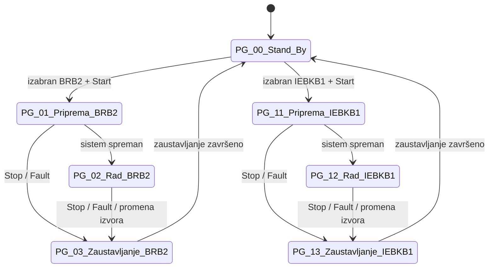
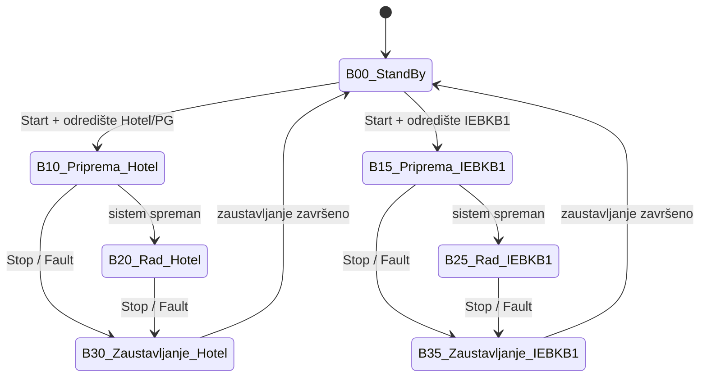

# Podstanica grejanja Kotlarnica Banja — dijagram rada sistema

> **Verzija:** 0.9 (draft za pregled i overu) • **Datum:** 2026-09-02 • **Autor:** Predrag • **Status:** draft za investitorsku i tehničku overu

> Dokument opisuje **kako rade dva PLC-a** koja zajedno kontrolišu podstanicu:
> - **PLC 1 — PT_KB_V01** kontroliše samu podstanicu (`PG_KB`).
> - **PLC 2 — BRB2_1** kontroliše bunar (`BRB2_rad`).
>
> Dva PLC-a razmenjuju podatke preko optičke veze (protokol AsIMA).

---

## Rečnik pojmova

| Pojam | Značenje |
|---|---|
| **BRB2** | Termalni izvor 2 — kompletan sistem: bunar sa vlastitim pumpama i **sopstvenim PLC-om (`BRB2_1`)**. Komunicira sa podstanicom preko AsIMA. |
| **IEBKB1** | Termalni izvor — takođe kompletan sistem: bunar sa vlastitim pumpama i **sopstvenim PLC-om**. Komunikacija sa podstanicom preko AsIMA (planirano). |
| **PLC 1 / PLC 2** | PLC 1 = kontroler podstanice (`PT_KB_V01`, projekat `PG_KB`). PLC 2 = kontroler bunara BRB2 (`BRB2_1`, projekat `BRB2_rad`). |
| **HMI** | Human-Machine Interface — operaterski panel (touch-screen) za komandovanje, prikaz stanja, alarme i unos SP-ova. Svaki PLC ima svoj HMI. |
| **SCADA** | Centralni sistem nadzora — prima podatke sa svih PLC-ova, log, alarmi, trendovi. |
| **PFD / P&ID** | PFD = Process Flow Diagram (konceptualna šema procesa, ovaj dokument). P&ID = Piping and Instrumentation Diagram (detaljna inženjerska šema — zaseban dokument). |
| **PV (Process Variable)** | **Merena** vrednost koju regulator poredi sa SP-om (npr. PV = trenutni nivo tanka, SP = zadati nivo tanka). |
| **ISA S5.1 prefiksi** | `TT` = temperatura, `PT` = pritisak, `FT`/`MP` = protok, `LS` = nivo (switch, digitalni), `PTNS` = pritisak niskog opsega. |
| **Interlock** | Logički uslov koji **mora biti ispunjen** pre nego što se određena akcija dozvoli (otvaranje ventila, start pumpe, prelaz u sledeći korak). Ako uslov nije ispunjen — akcija se blokira i sistem čeka ili odlazi u kontrolisano zaustavljanje. **Primer:** `PG_V01` sme da se otvori **samo ako je `PG_V02` zatvoren** — nikad oba istovremeno (razdvaja sistem pod nadpritiskom BRB2 od sistema bez nadpritiska IEBKB1, sprečava curenje i mešanje). |
| **SP (SetPoint)** | Zadata vrednost regulacije (npr. `SetPritisakPotisa = 5.5 bar`). Regulator održava mernu vrednost oko SP-a. |
| **RETAIN** | Promenljiva koja se **čuva u PLC memoriji i posle nestanka struje** — kad se PLC ponovo pokrene, vrednost je ista kao pre nestanka. Koristi se za selektore operatera (izvor, mod pumpe...) i za brojače faultova. |
| **AsIMA** | Protokol razmene podataka između dva B&R PLC-a preko optičke veze. U ovom projektu — između podstanice (`PT_KB_V01`) i bunara (`BRB2_1`). |
| **Fault (softverski / hitni)** | Softverski = otklonjivo, sistem pokušava retry 3× pa ide u zaustavljanje. Hitni = trenutno gašenje bez retry-a (npr. prepun tank, pritisak preko limita, kritični senzor izgubljen). Reset se daje sa HMI. |
| **Kontrolisano zaustavljanje** | Uređena sekvenca gašenja: rampa pumpi naniže, sekvencijalno zatvaranje ventila, drenaža po potrebi, prelaz u `Stand_By`. **Suprotno HITNOM gašenju** koje je trenutni stop svih aktuatora. |

---

## A. Šema procesa (konceptualni PFD)

> **KRITIČNI INTERLOCK:** `PG_V01` (IEBKB1 ulaz) i `PG_V02` (BRB2 ulaz) **nikad ne smeju biti istovremeno otvoreni**. Uslov za otvaranje bilo kog od njih je da je onaj drugi **zatvoren**. Razlog: razdvaja se sistem pod nadpritiskom (BRB2) od sistema bez nadpritiska (IEBKB1) — sprečava curenje i mešanje.

```
                    ┌── PG_PV05 ──> DRENAŽNI KANAL
                    │      • ispiranje: čeka T na TT_PG_07 ≥ 60 °C (SP sa HMI)
                    │      • drži pritisak dolaza BRB2 ≥ 5 bar (kad su ventili tanka zatvoreni)
                    │      • drži do 6.5 bar (kad su ventili tanka aktivni — štiti izmenjivače)
                    │      • anti-hidraulički udar: PT_PG_06 > 6.5 bar → auto open
                    │
BRB2 ulaz ──────────┤
(optika + komunikacija ka BRB2 PLC)
                    │                          ┌─ PG_V06 ─ PG_PV01 ─┐
                    └── PG_V02 ────────────────┤                    ├──┐
                                               └─ PG_V07 ─ PG_PV02 ─┘  │
                                                                       ├──> Prihvatni tank
IEBKB1 ulaz ──> PG_V01 ──> PG_V05 ─────────────────────────────────────┘
(optika + komunikacija ka IEBKB1 PLC)  (BYPASS ON/OFF, samo u IEBKB1 modu — direktno u tank, zaobilazi PG_PV01/PV02)
```

> **Važno o ulaznim ventilima:** `PG_V01` i `PG_V02` su **elektromotorni leptir ventili DN150** (`2×DO + 4×DI` po ventilu). Za razliku od pneumatskih (koji su „trenutni"), ovi imaju **hod 15–25 s** od komande do krajnjeg položaja. Interlock i timeout-e u E tabeli su podešeni prema tome. Svi ostali automatski ventili u sistemu (`PG_V03/V04/V05/V06/V07`, `PG_PV05`) su pneumatski (brz odziv < 1 s).

**Senzori na tanku** (nisu u state mašini — merenje/signalizacija):

- `LS_PG_01` — level switch, hi/lo signalizacija
- `TT_PG_03` — temperatura na dnu tanka
- `PTNS_PG_01` — pritisak na dnu tanka
- `PTNS_PG_02` — pritisak vrha tanka (vazdušni prostor)
- `NivoTanka = f(PTNS_PG_01 − PTNS_PG_02)` — izračunata vrednost, koristi se kao PV za regulaciju nivoa

**Izlazna sekcija (od tanka ka potrošačima):**

```
                     ┌── Pu_PG_01 ── PG_V03 ──┐
tank izlaz ─────────┤                          ├──> potis (PT_PG_05, MP_PG_01) ──> ka potrošačima
                     └── Pu_PG_02 ── PG_V04 ──┘  (SP prema `RegulacionaVarijanta` — vidi F.1)
```

Redosled: `tank izlaz` → račva → `Pu_PG_01/02` → `PG_V03/V04` → spajanje → `PT_PG_05`, `MP_PG_01` → potrošači.

### Ključni senzori

> **Napomena:** opsezi su preuzeti iz P&ID export-a *Podstanica 2026-09-01* (spisak uređaja i mernih instrumenata). Softver čita 16-bit skalirane vrednosti prema definiciji u `Types.typ`.

| Oznaka | Značenje | Opseg / jed. |
|---|---|---|
| `TT_PG_07` | Temperatura na drenaži iza `PG_PV05` — uslov za završetak ispiranja (SP = 60 °C, podesivo sa HMI). *Naziv rezervisan; senzor još nije ucrtan na aktuelnom P&ID-u; tip: Easytemp TMR35.* | 0–120 °C |
| `T_Sek_Izl` (generički) | Temperatura sekundara na izlazu iz velikog izmenjivača — PV za mod `temperatura`. **Izvor još nije fiksiran** (opcije: direktno merenje ili preko komunikacije). | TBD °C |
| `PT_PG_06` | Pritisak dolazne magistrale (pre `PG_V02`, na BRB2 ulazu) — anti-hidraulički udar i praćenje ulaznog pritiska. Tip: Cerabar PMP23. | −1–9 bar |
| `PT_PG_05` | Pritisak potisa iza pumpi `Pu_PG_01/02` — SP = `SetPritisakPotisa` (1–1.5 bar u modu `pritisak`). Tip: Cerabar PMP23. | −1–9 bar |
| `MP_PG_01` | Elektromagnetni merač protoka na potisu (donja/gornja granica u modu `pritisak`, monitoring uvek). Tip: Promag H10 DN065. | 0–72 m³/h (0–20 l/s) |
| `PTNS_PG_01` | Pritisak na **dnu** prihvatnog tanka (hidrostatički stub + P vazdušnog prostora). Tip: Cerabar niskog opsega. | −100…300 mbar |
| `PTNS_PG_02` | Pritisak u **vazdušnom prostoru** na vrhu prihvatnog tanka. **Nije potvrđen u trenutnom P&ID export-u — verifikovati sa projektantom.** | −100…300 mbar (očekivano) |
| `NivoTanka` (izračunata) | Nivo vode u prihvatnom tanku = f(`PTNS_PG_01` − `PTNS_PG_02`), preveden u metre. **Logička promenljiva za regulaciju** (ciljno 1.5 m, min 0.9 m, max 2.5 m). | 0–3 m |
| `LS_PG_01` | **Level switch** — diskretni prekidač za signalizaciju prepunjenja / niskog nivoa. **NE koristi se za regulaciju**, samo kao HW zaštita. Tip: Liquipoint FTW23. | digital |

### Izlazne pumpe podstanice (parametri iz P&ID)

- **`Pu_PG_01`, `Pu_PG_02`** — Grundfoss CR45-2A-F-A-E-H00E, vertikalne višestepene centrifugalne.
- **Radni opseg protoka: `MinFR_Pumpe` = 2 l/s, `MaxFR_Pumpe` = 16.2 l/s** (koristi se kao clamp u F.1).
- Signali: `1 x AO 4–20 mA` (zadata frekvencija / brzina), `1 x DI` (radi/stoji), `2 x DO` (start, reset).

### Ostali uređaji na razmenjivačima (van PG_KB regulacije)

Na P&ID-u postoje još senzori i aktuatori na strani razmenjivača koji **nisu deo state-mašine `PG_KB`** — koriste ih zasebni regulacioni krugovi (grejanje objekata, odzraka, higijena). Popisani su ovde samo radi jasnoće da se ne pomešaju sa signalima iz D.1 tabele:

| Oznaka | Namena |
|---|---|
| `TT_PG_05` | Temperatura na razmenjivačima (kandidat za `T_Sek_Izl` — vidi napomenu iznad). |
| `PT_PG_01/02/03` | Pritisci na razmenjivačima (monitoring, ne uđu u D.1). |
| `LS_PG_02/03` | Level switch na razmenjivačima. |
| `PG_PV03`, `PG_PV04` | Membranski proporcionalni ventili Burkert DN025 (odzraka i regulacija razmenjivača). |

### Selektori operatera (RETAIN — čuvaju se posle nestanka struje)

| Selektor | Vrednosti | Napomena |
|---|---|---|
| Izvor termalne vode | `nijedan` · `BRB2` · `IEBKB1` | Vidi F.2. |
| Regulaciona varijanta | `neaktivan` · `pritisak` · `protok` · `temperatura` | Vidi F.1. `temperatura` uslovna (izvor `T_Sek_Izl` TBD). |
| Aktivna izlazna pumpa | `Pu_PG_01` · `Pu_PG_02` | 1 radi, 1 rezerva; auto rotacija po satima rada. |
| Aktivni prop. ventil ulaza tanka | `PG_PV01` · `PG_PV02` | 1 aktivan, 1 rezerva; auto rotacija po satima rada. |
| AutoRestart posle nestanka struje | `OFF` · `ON` | ON → odloženi start 60 s pa auto `KomandaStart`. |

---

## B. PLC 1 — Podstanica (`PT_KB_V01 / PG_KB`)



### B.1 Šta radi svaki korak

| Korak | Opis |
|---|---|
| `PG_00_Stand_By` | Mirovanje. Sve pumpe stoje; ventili tanka (`PG_V06/V07`, `PG_PV01/02`), izlazni (`PG_V03/V04`) i bypass (`PG_V05`) su zatvoreni. **Ulazni ventili `PG_V01` i `PG_V02` prate `SelektovaniIzvor` (RETAIN):** ako je izabran BRB2 → `PG_V02` otvoren i `PG_V01` zatvoren; ako je izabran IEBKB1 → `PG_V01` otvoren i `PG_V02` zatvoren; ako izvor nije izabran → oba zatvorena. Interlock (nikad oba istovremeno otvorena) uvek važi. Sistem čeka komandu Start sa HMI. |
| `PG_01_Priprema_BRB2` | **Prvi uslov (interlock):** proverava da je `PG_V01` = zatvoren (razdvajanje sistema pod nadpritiskom od sistema bez nadpritiska). Ako nije — blok, greška, ne otvara ništa. Zatim **osigurava da je `PG_V02` otvoren** (obično već jeste iz Stand_By-a jer je BRB2 izabran); pušta bunar preko `PG_PV05` na drenažu, čeka da `TT_PG_07` dostigne 60 °C. Zatim preusmerava na tank (otvara `PG_V06/07` i aktivni `PG_PV01/02`), pali izabranu izlaznu pumpu `Pu_PG_01/02`. **Kad pumpa ustali regulaciju na svom SP-u prema aktivnoj `RegulacionaVarijanta` (F.1) — sistem ulazi u radno stanje.** |
| `PG_02_Rad_BRB2` | Rad sa BRB2 kao izvorom. **`PG_PV01/PV02` NE regulisu protok** — samo održavaju bezbedan pritisak u cevovodu (štite izmenjivače i tank). Ko šta drži zavisi od `RegulacionaVarijanta` (F.1): u `pritisak` varijanti BRB2 drži `NivoTanka` a pumpe drže `PT_PG_05`; u `protok` BRB2 drži svoj FT a pumpe drže `NivoTanka`; u `temperatura` BRB2 juri `T_Sek_Izl` a pumpe kombinovano drže nivo i pritisak potisa (radi zaštite od prelivanja tanka). Anti-udar: `PG_PV05` otvara auto kad `PT_PG_06` > 6.5 bar. |
| `PG_03_Zaustavljanje_BRB2` | Smanjuje protok, zatvara tank granu, gasi izlaznu pumpu, po potrebi zatvara `PG_V02` (samo ako se izvor menja u `Stand_By`-u). Šalje BRB2 komandu za gašenje bunara. Kad je gotovo — sistem se vraća u `PG_00_Stand_By`. |
| `PG_11_Priprema_IEBKB1` | **Prvi uslov (interlock):** proverava da je `PG_V02` = zatvoren (razdvajanje sistema pod nadpritiskom od sistema bez nadpritiska). Ako nije — blok, greška, ne otvara ništa. Zatim **osigurava da je `PG_V01` otvoren** (obično već jeste iz Stand_By-a jer je IEBKB1 izabran) i otvara bypass `PG_V05` ka tanku, pušta IEBKB1 pumpu, čeka punjenje tanka do 1.0 m. Startuje izlaznu pumpu. **Kad pumpa ustali regulaciju na svom SP-u prema aktivnoj `RegulacionaVarijanta` (F.1) — sistem ulazi u radno stanje.** |
| `PG_12_Rad_IEBKB1` | Rad sa IEBKB1 kao izvorom. `PG_V01` otvoren; voda ide preko bypass-a `PG_V05` **koji zaobilazi regulacione ventile `PG_PV01/PV02`** (oni su zatvoreni jer se u ovom režimu ne koristi njihova regulacija) i preko izmenjivača ulazi u tank. Ko šta drži zavisi od `RegulacionaVarijanta` (F.1) — ista logika kao BRB2, sa dodatnim clamp-om svih `SP_Protok` na `MaxProtok_IEBKB1`. |
| `PG_13_Zaustavljanje_IEBKB1` | Smanjuje protok IEBKB1, zatvara bypass `PG_V05`, gasi izlaznu pumpu, po potrebi zatvara `PG_V01` (samo ako se izvor menja u `Stand_By`-u). Kad je gotovo — sistem se vraća u `PG_00_Stand_By`. |

> **Važno o prelazu između izvora:** oba `Zaustavljanje` koraka **uvek** završavaju u `PG_00_Stand_By`. Promena izvora se dešava **samo iz `Stand_By`-a** — operater bira novi izvor na HMI i daje Start, pa sistem ide u odgovarajuću Pripremu. Nema prečice iz jednog Zaustavljanja u drugu Pripremu.

**Auto-restart posle nestanka struje:** sistem uvek startuje iz `PG_00_Stand_By`. Ponašanje kontroliše HMI selektor `AutoRestart` (RETAIN):
- **`AutoRestart = OFF`** — sistem ostaje u `Stand_By`, čeka manuelnu komandu Start sa HMI-ja.
- **`AutoRestart = ON`** — po isteku **odloženog starta 60 s** sistem automatski šalje `KomandaStart` prema poslednjem RETAIN izboru (`SelektovaniIzvor`, `RegulacionaVarijanta`) i prolazi kroz normalnu Pripremu → Rad. Odloženi start se prekida ako se u tih 60 s pojavi Fault ili operater lokalno pritisne Stop.

---

## C. PLC 2 — Bunar BRB2 (`BRB2_1 / BRB2_rad`)



### C.1 Šta radi svaki korak

| Korak | Opis |
|---|---|
| `B00_StandBy` | Mirovanje. Bunar ne radi, oba izlazna ventila zatvorena: `RB2_V01` (izlaz ka IEBKB1 grani) i `RB2_V02` (izlaz ka podstanici PG_KB). Sistem čeka izbor odredišta i komandu Start (od PG_KB preko IMA ili lokalno). |
| `B10_Priprema_Hotel` | Priprema za slanje vode ka podstanici. Verifikuje interlockove, startuje pumpu bunara na 20 Hz (rampa 0.5 Hz/s do izjednačavanja pritisaka), otvara **`RB2_V02`** (ventil ka podstanici PG_KB), prati pritisak **`Pt_RB2_2`** dok ne dostigne 5 bar. |
| `B15_Priprema_IEBKB1` | Priprema za slanje vode ka IEBKB1. Verifikuje interlockove, otvara **`RB2_V01`** (jedini izlaz ka IEBKB1 grani), startuje pumpu bunara. **Nema praćenja pritiska** — cevovod ka IEBKB1 nije opremljen mernom instrumentacijom; spremnost za rad se dobija po komandi/signalu od IEBKB1 kontrolera (ili istekom fiksnog vremena rampe pumpe). |
| `B20_Rad_Hotel` | Rad ka podstanici. Frekvencija pumpe se reguliše prema odabranoj varijanti: **pritisak** (PG diktira), **protok** (BRB2 fiksni 6 l/s) ili **temperatura/snaga**. Dvosmerno mirror-uje stanje sa PG_KB preko IMA. |
| `B25_Rad_IEBKB1` | Rad ka IEBKB1 preko `RB2_V01`. Uvek regulacija po protoku. **Nema praćenja pritiska** na potisnoj strani ka IEBKB1. |
| `B30_Zaustavljanje_Hotel` | Rampa pumpe naniže (0.25 Hz/s), održava pritisak 5.2 bar dok protok ne padne na 0. Zatvara `RB2_V02`, gasi pumpu. Kad je gotovo — sistem se vraća u `B00_StandBy`. |
| `B35_Zaustavljanje_IEBKB1` | Rampa pumpe naniže do 0 (fiksno vreme rampe, bez povratne sprege po pritisku). Zatvara `RB2_V01`, gasi pumpu. Kad je gotovo — sistem se vraća u `B00_StandBy`. |

> **Važno o odabiru odredišta:** odredište (podstanica PG_KB vs IEBKB1) se bira **pre** Pripreme. Priprema ka PG_KB otvara `RB2_V02` i regulisano prati pritisak `Pt_RB2_2` (5 bar). Priprema ka IEBKB1 otvara `RB2_V01` i **radi bez povratne sprege po pritisku** — cevovod ka IEBKB1 nema mernu instrumentaciju. Promena odredišta se dešava **samo iz `B00_StandBy`-a** (nema prečice iz jednog Zaustavljanja u drugu Pripremu). **Nema zajedničke izolacije bunara** — pumpa `Pu_RB2_01/02` je direktno spojena na razvod, tako da su izlazni ventili grana jedini uređaji koji fizički razdvajaju granu.

---

## D. Šta razmenjuju PLC 1 i PLC 2 (AsIMA)

> Filozofija: **sve vrednosti idu na obe strane** (optika je brza i pouzdana, korisno za HMI vizualizaciju na obe lokacije).

### D.1 PG_KB → BRB2 (šta podstanica šalje bunaru)

| Signal | Namena |
|---|---|
| `SelektovaniIzvor`, `RegulacionaVarijanta` | Ogledalo selektora sa HMI podstanice. |
| `KomandaStart`, `KomandaStop` | Komanda bunaru iz PG_KB state mašine. |
| `SpremanZaBRB2` | Podstanica javlja da je spremna da prihvati vodu (nivo, pritisak, nema fault-a). |
| `Sens.*` (`NivoTanka`, `LS_PG_01`, `PT_PG_05`, `MP_PG_01`, `TT_PG_07`, `PT_PG_06`, `PTNS_PG_01`, `PTNS_PG_02`) | Sve merne vrednosti — za HMI na BRB strani. |
| `Act.*` (otvor PG_PV01/02/05, FR izlaznih pumpi) | Trenutno stanje aktuatora — za HMI. |

### D.2 BRB2 → PG_KB (šta bunar šalje podstanici)

| Signal | Namena |
|---|---|
| `PumpaAktivna`, `FR_Actual` | Status bunarske pumpe. |
| `FaultLatched`, `FaultCode` | Ako BRB2 ima grešku — PG ide u kontrolisano zaustavljanje. |
| `Sens.*` (PT bunara, FT bunara, TT bunara) | Merne vrednosti sa bunara — za HMI podstanice. |
| `Act.*` (Pumpa_snaga, otvor RB2_V01/02) | Trenutno stanje aktuatora bunara. |

**Ako AsIMA veza padne > 5 s** → obe strane idu u kontrolisano zaustavljanje.

### D.3 PG_KB → IEBKB1 (planirano — ista logika kao D.1)

Struktura poruke identična kao D.1. Razlika u parametrizaciji: IEBKB1 grana ima ograničen maksimalni protok, pa se `SP_Protok` pre slanja clamp-uje na `MaxProtok_IEBKB1` (RETAIN konstanta iz projekta / HMI).

### D.4 IEBKB1 → PG_KB (planirano — ista logika kao D.2)

Struktura poruke identična kao D.2. Ista fault i timeout logika: **AsIMA link IEBKB1 pao > 5 s** → kontrolisano zaustavljanje na obe strane.

---

## E. Greške i reset

Svaki uslov greške ima definisan SP: prag vrednosti i/ili trajanje (debounce) pre okidanja.

| Greška | Uslov / SP | Reakcija |
|---|---|---|
| Interlock nije OK u Pripremi | invalid interlock signal (nedostatak potvrde `CLOSED` na drugom ventilu) > **2 s** (V01/V02 su elektromotorni) | Prelaz u Zaustavljanje, čeka reset sa HMI. |
| `PG_V01` ili `PG_V02` ne dostiže krajnji položaj | od komande do potvrde LSU (`OPEN` ili `CLOSED`) > **30 s** | Zaustavljanje, greska, potreban reset i inspekcija ventila. |
| **Interlock `PG_V01` + `PG_V02` istovremeno OPEN** | oba povratna kontakta `= OPEN` > **200 ms** | **HITNO** gašenje: oba ventila CLOSED, sve pumpe STOP, `PG_PV05` OPEN, prelaz u `PG_00_Stand_By` sa lokovanom greškom — zahteva reset i inspekciju. |
| BRB2/IEBKB1 ne odgovara na komandu | odziv na `KomandaStart`/`KomandaStop` > **30 s** | Kontrolisano zaustavljanje. |
| Ispiranje predugo | `TT_PG_07 < 60 °C` posle **10 min** od starta ispiranja | Pauza, retry 3×; posle 3. → zaustavljanje. |
| Nivo tanka previsok | `NivoTanka > 2.5 m` **ili** `LS_PG_01_hi` aktivan > **2 s** | **HITNO:** svi ventili zatvoreni, pumpe stop, `PG_PV05` otvoren. |
| Nivo tanka nizak tokom rada | `NivoTanka < 0.3 m` **ili** `LS_PG_01_lo` aktivan > **30 s** | Pauza, retry 3×; posle 3. → zaustavljanje. |
| Pritisak dolaza previsok | `PT_PG_06 > 8 bar` > **1 s** | **HITNO** gašenje. |
| Alarm izlazne pumpe | trip signal `Pu_PG_01/02` **ili** struja > **120 % In** > **5 s** | Zaustavljanje, retry sa rotacijom pumpi ako je moguće. |
| AsIMA link pao | timeout > **5 s** | Kontrolisano zaustavljanje na obe strane. |
| Kritičan senzor izgubljen | vrednost van opsega (`< 0` ili `> nominalni raspon`) > **2 s** | **HITNO** gašenje. |

**Reset:** operater na HMI daje `KomandaReset`; sistem se vraća u `PG_00_Stand_By` ako je uzrok otklonjen.

**Prijava alarma:** svaka greška se javlja istovremeno na **HMI podstanice (PT_KB)**, **HMI BRB2** i **centralnu SCADA**. Kod, vreme i opis se logiraju lokalno u RETAIN buferu (poslednjih 100 događaja) i šalju u SCADA istoriju.

---

## F. Modovi rada

### F.1 Regulaciona varijanta (`RegulacionaVarijanta`)

Selektor sa HMI, RETAIN. Definiše ko šta reguliše u lancu bunar → tank → bazeni. **Bunar uvek ima ograničenja `Min/MaxProtok` i `Min/MaxFR_Pumpe`.**

| Varijanta | Bunar drži | Pumpe podstanice Pu_PG_01/02 drže | Šta PG_KB šalje bunaru |
|---|---|---|---|
| `pritisak` | `NivoTanka` (željeni nivo u prihvatnom tanku) | `PT_PG_05` = **1–1.5 bar** (pritisak potisa ka bazenima) | `SP_NivoTanka` (a) **ili** `SP_Protok = f(NivoTanka)` (b) — izbor sa HMI |
| `protok` | svoj `FT bunara` = `SP_Protok` (direktno sa HMI) | `NivoTanka` (menjaju svoj protok potisa da drže zadati nivo tanka) | `SP_Protok` direktno sa HMI |
| `temperatura` | podiže `SP_Protok` dok `T_Sek_Izl` ne dostigne `SP_T_Sek_Izl` | kombinovano: primarno `NivoTanka` (jer bunar u traženju temperature može stvoriti prevelik protok i preliti tank), sekundarno `PT_PG_05` kad ima rezerve | PG_KB računa `SP_Protok = f(T_Sek_Izl)`, ograničeno `MaxProtok` odnosno `MaxFR_Pumpe` |

> **Važno:** za IEBKB1 kao izvor sve vrednosti `SP_Protok` se dodatno clamp-uju na `MaxProtok_IEBKB1` (grana ima manji kapacitet od BRB2).
>
> **Napomena o modu `temperatura`:** dostupan je samo kad se fiksira izvor senzora `T_Sek_Izl` (direktno merenje ili preko komunikacije). Do tada je varijanta `temperatura` blokirana na HMI-ju — selektor je vidljiv ali sa oznakom *nedostupno*.

### F.2 Izbor izvora (`SelektovaniIzvor`)

| Vrednost | Ulazna grana | Napomena |
|---|---|---|
| `BRB2` | `PG_V02` OPEN, `PG_V01` CLOSED | Standardni režim — pun kapacitet. |
| `IEBKB1` | `PG_V01` OPEN, `PG_V02` CLOSED, opciono `PG_V05` BYPASS | Ograničen maksimalni protok (`MaxProtok_IEBKB1`). |

**Kritični interlock:** `PG_V01` i `PG_V02` nikada istovremeno otvoreni — hardverska i softverska brava; kršenje → HITNO gašenje (vidi sekciju E).

---

## G. Napomene za nastavak rada

- Detaljne substep-ove svake faze (šta u kom trenutku otvara/zatvara), IMA sequence sa vremenskim redosledom, kompletnu tabelu fault kodova (F01…F70) i status implementacije po fajlovima — vidi `TEHNICKI_DODATAK.md` u istom folderu.
- Kod za state mašine: `Cyclic.st` u [Rad_PG_KB/](.) (PT_KB_V01) i `Cyclic.sfc` u `BRB2_1/Logical/Project/BRB2_rad/`.
- Deklaracije tipova i strukture: `Types.typ` u istim folderima.
