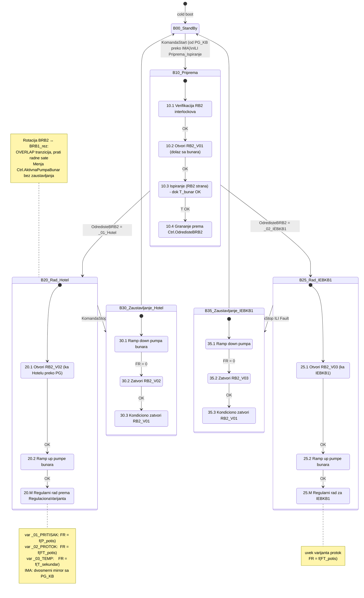
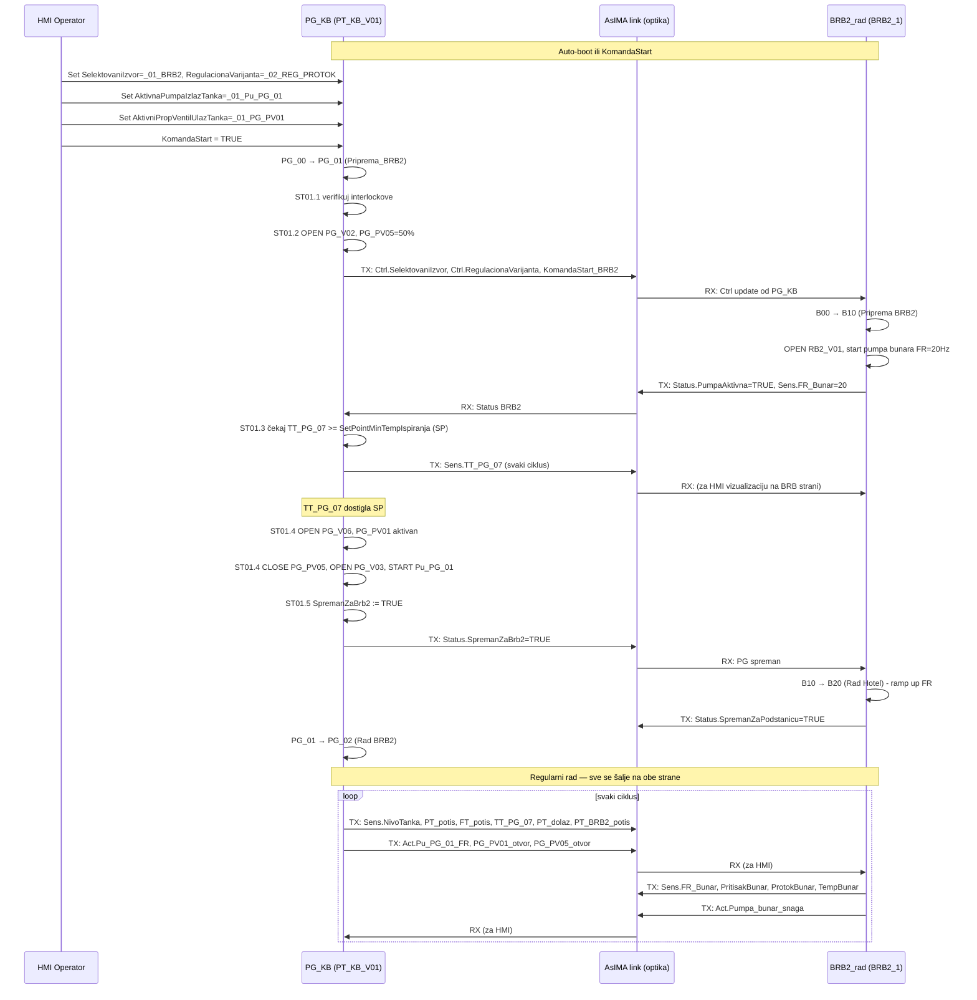
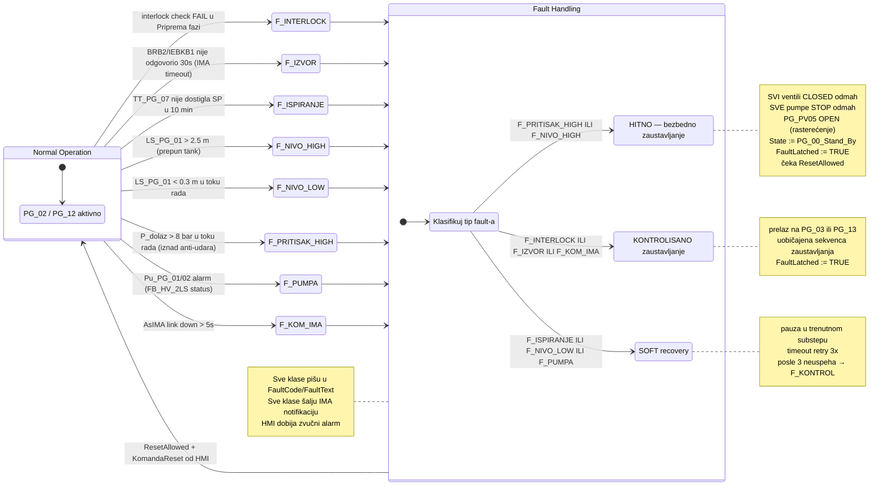

# FLOW CHART MASTER — Rad_PG_KB + BRB2_rad

> Detaljni operativni dijagrami za state mašinu Podstanice Grejanja Kotlarnica Banja (PG_KB)
> i BRB2 (bunar) sa vezama preko AsIMA. Svi substepovi, tranzicije, akcije, timeouti.

---

## A. ASCII P&ID skica (referenca za sve dijagrame)

> **VAŽNO — topologija PG_PV05:** proporcionalni ventil `PG_PV05` je **odvojak PRE** `PG_V02` (ne posle). Odvaja se od dolazne BRB2 magistrale i vodi na drenažni kanal. `PG_V05` je zaseban ON/OFF ventil na bypass grani IEBKB1 — nema nikakve veze sa `PG_PV05`.

```
                    ┌── PG_PV05 ──> DRENAŽNI KANAL
                    │      • ispiranje: čeka T na TT_PG_07 >= 60 °C (SP podesiv sa HMI)
                    │      • održavanje pritiska ≥ 5 bar na potisu BRB2 dok su
                    │        ventili tanka zatvoreni (drži bunar u režimu)
                    │      • održavanje 6–7 bar dok su ventili tanka aktivni
                    │        (rasterećenje ka drenaži — štiti izmenjivače i cev)
                    │      • anti-hidraulički udar: P_dolaz > 6.5 bar → auto open
                    │
BRB2 ulaz ──────────┤
(optika ka BRB2_1)  │
                    │                          ┌─ PG_V06 ─ PG_PV01 ─┐
                    └── PG_V02 ────────────────┤                    ├──> Prihvatni tank
                                               └─ PG_V07 ─ PG_PV02 ─┘         │
                                                                              │  ┌ LS_PG_01 (nivo, SP=1.5m)
                                                                              │  ┌ PTNS_PG_01 (P,T,N)
                                                                              │
IEBKB1 ulaz ──> PG_V01 ──────────────> PG_V05 ────────────────────────────────┤
(optika ka IEBKB1)                    (BYPASS ON/OFF —                        │
                                       aktivan samo u IEBKB1 modu)            │
                                                                              │
                                                                       ┌── PG_V03 ── Pu_PG_01 ──┐
                                                                       │                        ├──> ka potrošačima
                                                                       └── PG_V04 ── Pu_PG_02 ──┘  (SP_PritisakPotisa)
```

**Senzori (logička imena u dokumentu → putanja u kodu):**

| Logičko ime | Putanja u kodu | Namena |
|---|---|---|
| `TT_PG_07` | `PG.Sens.Tt._4` (**NOVI — treba dodati u `PG_Sens_Tt_type`**) | Temperatura na drenažnoj cevi iza `PG_PV05` — uslov za završetak ispiranja (SP = 60 °C, podesiv sa HMI) |
| `PG_PT_dolaz` | `PG.Sens.Pt._1` | Pritisak termalne vode na ulazu u podstanicu (pre `PG_V02`) — uslov za anti-udar |
| `PG_PT_potis` | `PG.Sens.Pt._5` | Pritisak potisa iza pumpi `Pu_PG_01/02` (SP = `SetPritisakPotisa`) |
| `PG_PT_BRB2_potis` | `PG.Sens.Pt._6` | Dodatni transmiter -1..9 bar — pritisak dolazne magistrale iza `PG_V02` (mirror preko IMA ka BRB2) |
| `PG_FT_potis` | `PG.Sens.MP._1` | Protok potisa (za `MinProtok/MaxProtok` granice u varijanti 1) |
| `LS_PG_01` | `PG.Sens.LS._1` | Nizak nivo vode u prihvatnom tanku (SP = 1.5 m ciljno) |
| `PTNS_PG_01` | `PG.Sens.Pt._NS1` + `_NS2` | Pritisak na dnu (`_NS1`) i vrhu (`_NS2`) prihvatnog tanka (za proračun nivoa i P u vazdušnom prostoru) |

**Enumerisani selektori (RETAIN, definisani u [Types.typ](Types.typ)):**

| Selektor | Vrednosti |
|---|---|
| `SelektovaniIzvor` (`E_SelektovaniIzvor`) | `_00_nijedan`, `_01_BRB2`, `_02_IEBKB1` |
| `RegulacionaVarijanta` (`E_RegulacionaVarijanta`) | `_00_neaktivan`, `_01_REG_PRITISAK`, `_02_REG_PROTOK`, `_03_REG_TEMPERATURA` |
| `AktivnaPumpaIzlazTanka` (`E_AktivnaPumpaIzlazTanka`) | `_00_nijedna`, `_01_Pu_PG_01`, `_02_Pu_PG_02` |
| `AktivniPropVentilUlazTanka` (`E_AktivniPropVentilUlazTanka`) | `_00_nijedan`, `_01_PG_PV01`, `_02_PG_PV02` |

---

## B. PG_KB state mašina — detaljni stateDiagram

```mermaid
stateDiagram-v2
    direction TB

    [*] --> PG_00_Stand_By: cold boot (State default)

    state PG_00_Stand_By {
        [*] --> ST00_1
        ST00_1: 00.1 Verifikuj mirovanje sistema
        note right of ST00_1
            svi ventili CLOSED
            sve pumpe STOP
            SpremanZaBrb2 := FALSE
            SpremanZaIebkb1 := FALSE
        end note
    }

    PG_00_Stand_By --> PG_01_Priprema_BRB2: SelektovaniIzvor = _01_BRB2\nAND RegulacionaVarijanta <> _00_neaktivan\nAND KomandaStart
    PG_00_Stand_By --> PG_11_Priprema_IEBKB1: SelektovaniIzvor = _02_IEBKB1\nAND RegulacionaVarijanta <> _00_neaktivan\nAND KomandaStart

    %% ═══════════ GRANA BRB2 ═══════════
    state PG_01_Priprema_BRB2 {
        direction TB
        [*] --> ST01_1

        ST01_1: 01.1 Verifikacija interlockova
        note right of ST01_1
            check: PG_V01 = CLOSED
            check: PG_V06 = CLOSED, PG_V07 = CLOSED
            check: PG_V05 = CLOSED
            check: Pu_PG_01 = STOP, Pu_PG_02 = STOP
            check: PG_V03 = CLOSED, PG_V04 = CLOSED
            timeout 5s → Fault F01_INTERLOCK
        end note

        ST01_1 --> ST01_2: interlockovi OK

        ST01_2: 01.2 Otvaranje BRB2 dolaza + start ispiranja
        note right of ST01_2
            PG_V02 → OPEN
            PG_PV05 → 50% (drenaža otvorena)
            IMA: signal BRB2 = "start bunara u ispiranje modu (FR=20Hz)"
            čekaj potvrdu BRB2.PumpaAktivna = TRUE
            timeout 30s → Fault F02_BRB2_NEODZIVA
        end note

        ST01_2 --> ST01_3: BRB2 pumpa startovala

        ST01_3: 01.3 Čekanje temperature ispiranja
        note right of ST01_3
            monitor: TT_PG_07 >= SetPointMinTempIspiranja (60°C, podesivo sa HMI)
            trajanje ispiranja: obično 2-5 min
            timeout 10 min → Fault F03_ISPIRANJE_TIMEOUT
        end note

        ST01_3 --> ST01_4: T_dren dostigla SP

        ST01_4: 01.4 Preusmerenje na tank
        note right of ST01_4
            AKO AktivniPropVentilUlazTanka = _01_PG_PV01:
                PG_V06 → OPEN
                PG_PV01 → aktivan (regulacija nivoa tanka)
            AKO _02_PG_PV02:
                PG_V07 → OPEN
                PG_PV02 → aktivan
            pauza 2s (stabilizacija)
            PG_PV05 → 0% (zatvori drenažu)
            AKO AktivnaPumpaIzlazTanka = _01_Pu_PG_01:
                PG_V03 → OPEN
                Pu_PG_01 → START sa niskim FR (ramp up)
            AKO _02_Pu_PG_02:
                PG_V04 → OPEN
                Pu_PG_02 → START
        end note

        ST01_4 --> ST01_5: ventili otvoreni, pumpa startovala

        ST01_5: 01.5 Signal spremnosti
        note right of ST01_5
            čekaj: nivo tanka > 1.0 m (75% SP)
            čekaj: pritisak potisa >= 90% SP_PritisakPotisa
            čekaj: nema fault-ova
            SpremanZaBrb2 := TRUE
            IMA: šalji spremnost BRB2
        end note
    }

    PG_01_Priprema_BRB2 --> PG_02_Rad_BRB2: 01.5 OK → prelaz na rad
    PG_01_Priprema_BRB2 --> PG_03_Zaustavljanje_BRB2: Fault ILI KomandaStop

    state PG_02_Rad_BRB2 {
        direction TB
        [*] --> ST02_MAIN

        ST02_MAIN: 02.0 Regularni rad
        note right of ST02_MAIN
            aktivni PG_PV01/PV02 → PID(SetPointNivoTanka=1.5m)
            aktivna Pu_PG_01/02 → PID(SetPritisakPotisa)
            monitor MinProtok/MaxProtok override
            IMA: dvosmerni mirror stanja PG↔BRB2
        end note

        ST02_MAIN --> ST02_ANTI: P_dolaz > SetPointMaxPritisakDolaznaCev (6.5 bar)
        ST02_MAIN --> ST02_ROT: uslov rotacije pumpi (radni sati / manuelni zahtev)

        ST02_ANTI: 02.A Anti-hidraulički udar
        note right of ST02_ANTI
            PG_PV05 → auto otvaranje na drenažu (proporcionalno)
            trajanje: dok P_dolaz > 6.4 bar (histerezis 0.1)
            akcija u pozadini, ne menja stanje
        end note
        ST02_ANTI --> ST02_MAIN: P_dolaz < 6.4 bar (histerezis)

        ST02_ROT: 02.R Rotacija Pu_PG_01 ↔ Pu_PG_02
        note right of ST02_ROT
            OVERLAP tranzicija:
              1. start pratite pumpu na 0 Hz
              2. ramp up nova pumpa
              3. ramp down aktivna pumpa
              4. AktivnaPumpaIzlazTanka := novo
              5. zatvori stari PG_V03/V04
        end note
        ST02_ROT --> ST02_MAIN: rotacija završena
    }

    PG_02_Rad_BRB2 --> PG_03_Zaustavljanje_BRB2: KomandaStop\nILI Fault\nILI SelektovaniIzvor promena

    state PG_03_Zaustavljanje_BRB2 {
        direction TB
        [*] --> ST03_1

        ST03_1: 03.1 Redukcija protoka
        note right of ST03_1
            IMA: signal BRB2 = "ramp down bunara"
            PG_PV01/PV02 → ramp down otvor (5s)
            čekaj: protok < 10% MaxProtok
        end note

        ST03_1 --> ST03_2: protok nizak

        ST03_2: 03.2 Zatvaranje tank grane
        note right of ST03_2
            PG_V06 → CLOSED (ili PG_V07)
            PG_PV01 → 0% (ili PG_PV02)
            pauza 1s
        end note

        ST03_2 --> ST03_3: tank grana zatvorena

        ST03_3: 03.3 Zaustavljanje izlazne pumpe
        note right of ST03_3
            Pu_PG_01 → ramp down (ili Pu_PG_02)
            čekaj: pumpa STOP
            PG_V03 → CLOSED (ili PG_V04)
        end note

        ST03_3 --> ST03_4: izlaz zatvoren

        ST03_4: 03.4 Uslovno zatvaranje BRB2 dolaza
        note right of ST03_4
            AKO SelektovaniIzvor menja se u _02_IEBKB1:
                PG_V02 → CLOSED
                IMA: BRB2 = "stop bunara"
            AKO se izvor ne menja:
                PG_V02 ostaje OPEN (za brz restart)
                IMA: BRB2 = "stop bunara"
        end note
    }

    PG_03_Zaustavljanje_BRB2 --> PG_00_Stand_By: 03.4 OK, izvor se ne menja
    PG_03_Zaustavljanje_BRB2 --> PG_11_Priprema_IEBKB1: 03.4 OK, izvor promenjen u _02_IEBKB1

    %% ═══════════ GRANA IEBKB1 ═══════════
    state PG_11_Priprema_IEBKB1 {
        direction TB
        [*] --> ST11_1

        ST11_1: 11.1 Verifikacija interlockova
        note right of ST11_1
            check: PG_V02 = CLOSED
            check: PG_V06 = CLOSED, PG_V07 = CLOSED
            check: PG_PV05 = 0%
            check: PG_V05 = CLOSED
            check: PG_V03 = CLOSED, PG_V04 = CLOSED
            timeout 5s → Fault F11_INTERLOCK
        end note

        ST11_1 --> ST11_2: interlockovi OK

        ST11_2: 11.2 Otvaranje IEBKB1 grane
        note right of ST11_2
            PG_V01 → OPEN
            pauza 1s
            PG_V05 → OPEN (bypass ka tanku)
            IMA: signal IEBKB1 = "start pumpa sa zadatim protokom"
            čekaj potvrdu IEBKB1.PumpaAktivna
            timeout 30s → Fault F12_IEBKB1_NEODZIVA
        end note

        ST11_2 --> ST11_3: IEBKB1 pumpa startovala

        ST11_3: 11.3 Punjenje tanka
        note right of ST11_3
            monitor: nivo tanka raste
            čekaj: nivo >= 1.0 m (75% SP)
            timeout 5 min → Fault F13_PUNJENJE_TIMEOUT
        end note

        ST11_3 --> ST11_4: nivo dostignut

        ST11_4: 11.4 Start izlaza
        note right of ST11_4
            PG_V03 → OPEN (ili PG_V04)
            Pu_PG_01 → START (ili Pu_PG_02)
            čekaj: pritisak potisa >= 90% SP
            SpremanZaIebkb1 := TRUE
        end note
    }

    PG_11_Priprema_IEBKB1 --> PG_12_Rad_IEBKB1: 11.4 OK
    PG_11_Priprema_IEBKB1 --> PG_13_Zaustavljanje_IEBKB1: Fault ILI KomandaStop

    state PG_12_Rad_IEBKB1 {
        direction TB
        [*] --> ST12_MAIN

        ST12_MAIN: 12.0 Regularni rad IEBKB1
        note right of ST12_MAIN
            IEBKB1 pumpa gura zadati protok
            nivo tanka reguliše se protokom IEBKB1 (bez PG_PV01/PV02)
            PG_V05 stalno OPEN
            Pu_PG_01/02 → PID(SetPritisakPotisa)
            IMA: dvosmerni mirror stanja PG↔IEBKB1
        end note

        ST12_MAIN --> ST12_ROT: uslov rotacije izlaznih pumpi
        ST12_ROT: 12.R Rotacija Pu_PG_01 ↔ Pu_PG_02 (isti OVERLAP)
        ST12_ROT --> ST12_MAIN: rotacija završena
    }

    PG_12_Rad_IEBKB1 --> PG_14_Transfer_IEBKB1_BRB2: KomandaTransferNaBRB2\nI BRB2Ready\nI kompletan IEBKB1 statusni ugovor
    PG_12_Rad_IEBKB1 --> PG_13_Zaustavljanje_IEBKB1: KomandaStop\nILI Fault\nILI SelektovaniIzvor promena

    state PG_14_Transfer_IEBKB1_BRB2 {
        [*] --> ST14_0
        ST14_0: Opoziv IEBKB1 zahteva i cekanje nultog protoka
        ST14_0 --> ST14_1: IEBKB1 protok = 0
        ST14_1: Zatvaranje PG_V05
        ST14_1 --> ST14_2: PG_V05 CLOSED
        ST14_2: Zatvaranje i potvrda PG_V01
        ST14_2 --> ST14_3: PG_V01 CLOSED
        ST14_3: Otvaranje PG_V02 uz interlock
        ST14_3 --> ST14_4: PG_V02 OPEN
        ST14_4: Paralelno PG_PV05/PT06 rampa i PG_PV01/PV02/PT04 regulacija
    }

    PG_14_Transfer_IEBKB1_BRB2 --> PG_02_Rad_BRB2: BRB2 protok potvrden\nI PG_PV05 zatvoren
    PG_14_Transfer_IEBKB1_BRB2 --> PG_13_Zaustavljanje_IEBKB1: IEB stop / V05 / V01 fault
    PG_14_Transfer_IEBKB1_BRB2 --> PG_03_Zaustavljanje_BRB2: V02 / BRB2 protok fault

    state PG_13_Zaustavljanje_IEBKB1 {
        direction TB
        [*] --> ST13_1

        ST13_1: 13.1 Redukcija protoka IEBKB1
        note right of ST13_1
            IMA: signal IEBKB1 = "ramp down pumpe"
            čekaj: protok < 10% MaxProtok
        end note

        ST13_1 --> ST13_2: protok nizak

        ST13_2: 13.2 Zatvaranje bypass
        note right of ST13_2
            PG_V05 → CLOSED
            pauza 1s
        end note

        ST13_2 --> ST13_3: bypass zatvoren

        ST13_3: 13.3 Zaustavljanje izlazne pumpe
        note right of ST13_3
            Pu_PG_01/02 → ramp down + STOP
            PG_V03/V04 → CLOSED
        end note

        ST13_3 --> ST13_4: izlaz zatvoren

        ST13_4: 13.4 Uslovno zatvaranje IEBKB1 dolaza
        note right of ST13_4
            AKO SelektovaniIzvor menja se u _01_BRB2:
                PG_V01 → CLOSED
            AKO se izvor ne menja:
                PG_V01 ostaje OPEN (za brz restart)
            IMA: IEBKB1 = "stop pumpa"
        end note
    }

    PG_13_Zaustavljanje_IEBKB1 --> PG_00_Stand_By: 13.4 OK, izvor se ne menja
    PG_13_Zaustavljanje_IEBKB1 --> PG_01_Priprema_BRB2: 13.4 OK, izvor promenjen u _01_BRB2

    %% ═══════════ AUTO-RESTART ═══════════
    note left of PG_00_Stand_By
        AUTO-RESTART posle nestanka struje:
        - State := PG_00_Stand_By (uvek)
        - Ako RETAIN.SelektovaniIzvor <> _00_nijedan
          I RETAIN.RegulacionaVarijanta <> _00_neaktivan
          → automatski KomandaStart → prelaz na 01/11
        - NE zatvara ventile koji su bili otvoreni pre restart-a
          (Priprema faza to prepoznaje kroz interlock check)
    end note
```



---

## C. BRB2_rad state mašina (podsetnik) — proširena Hotel + IEBKB1 grana



---

## D. IMA komunikacija PG↔BRB2 — swimlane sekvenca (Priprema BRB2)



---

## E. Fault dijagram + Recovery putanje



### E.1 Registar fault kodova (`FaultCode : USINT`)

| Kod | Klasa | Okidač | Akcija oporavka |
|-----|-------|--------|-----------------|
| `F01_INTERLOCK` | KONTROL | Interlock check fail u `PG_01` (BRB2 grana) — neki ventil nije u CLOSED, pumpe rade | Zaustavljanje kroz `PG_03` sekvencu; čeka `KomandaReset` |
| `F02_BRB2_NEODZIVA` | KONTROL | BRB2 pumpa nije potvrdila `PumpaAktivna` u 30 s (IMA timeout u `ST01_2`) | Prelaz `PG_03_Zaustavljanje_BRB2`, IMA notifikacija |
| `F03_ISPIRANJE_TIMEOUT` | SOFT | `TT_PG_07` nije dostigla SP (60 °C) u 10 min | Retry 3× (produžava `T_ispiranje`); posle 3. → KONTROL |
| `F11_INTERLOCK` | KONTROL | Interlock check fail u `PG_11` (IEBKB1 grana) | Zaustavljanje kroz `PG_13`; čeka reset |
| `F12_IEBKB1_NEODZIVA` | KONTROL | IEBKB1 pumpa nije potvrdila aktivnost u 30 s | `PG_13_Zaustavljanje_IEBKB1`, IMA notifikacija |
| `F13_PUNJENJE_TIMEOUT` | SOFT | Nivo tanka nije dostigao 1.0 m u 5 min tokom IEBKB1 punjenja | Retry 3×; posle 3. → KONTROL |
| `F20_NIVO_HIGH` | HITNO | `LS_PG_01` mapiran nivo > 2.5 m (prepun tank) | Svi ventili CLOSED, sve pumpe STOP, `PG_PV05` OPEN, State := `PG_00`, `FaultLatched := TRUE` |
| `F21_NIVO_LOW` | SOFT | `LS_PG_01` < 0.3 m u toku aktivnog rada | Pauza substepa, retry 3×; posle 3. → KONTROL |
| `F30_PRITISAK_HIGH` | HITNO | `PG_PT_dolaz` > 8 bar (iznad anti-udar praga 6.5) | HITNO gašenje kao `F20` |
| `F31_ANTI_UDAR_TRAJE` | SOFT | Anti-udar rasterećenje traje > 60 s bez pada P_dolaz-a | Retry 3×; posle 3. → KONTROL |
| `F40_PUMPA_PG` | SOFT | Alarm `Pu_PG_01/02` (FB_HV_2LS status) — pumpa ne prati komandu | Pauza, retry pokretanja; posle 3. → KONTROL sa rotacijom pumpi ako moguće |
| `F50_KOM_IMA` | KONTROL | AsIMA link down > 5 s | `PG_03/PG_13` kontrolisano gašenje; `FaultLatched` dok se link ne uspostavi + operater ne resetuje |
| `F60_KOM_BRB2` | KONTROL | Prijavljen `BRB2.FaultLatched = TRUE` preko IMA | `PG_03_Zaustavljanje_BRB2` |
| `F70_SENZOR_LOST` | HITNO | `ConfigValid = FALSE` na kritičnom `FBAI01_DI01` (Pt._1/._5/._6, MP._1, Tt._4) | HITNO gašenje |

**Reset uslovi:** `KomandaReset` sa HMI + `ResetAllowed = TRUE` (svi FB-ovi imaju `ResetAllowed` izlaz posle BR_Lib update-a).

---

## F. Mapa `.st` fajlova (nomenklatura per substep)

Predlažem sledeću strukturu (spremno za korak 3):

```
PT_KB_V01/Logical/Rad_PG_KB/
├── Cyclic.st                       (CASE dispečer - samo poziva substepove)
├── Init.st                          (default vrednosti SP-ova na cold boot)
├── Exit.st
├── Types.typ                        ✅ ažurirano
├── Variables.var
├── IEC.prg
└── Substeps/
    ├── PG_00_Stand_By.st
    ├── PG_01_1_Interlockovi.st
    ├── PG_01_2_Otvaranje_Ispiranje.st
    ├── PG_01_3_Cekanje_Temperature.st
    ├── PG_01_4_Preusmerenje_Tank.st
    ├── PG_01_5_Signal_Spreman.st
    ├── PG_02_Rad_BRB2.st
    ├── PG_02_A_Anti_Udar.st
    ├── PG_02_R_Rotacija_Pumpi.st
    ├── PG_03_1_Redukcija_Protoka.st
    ├── PG_03_2_Zatvaranje_Tank.st
    ├── PG_03_3_Zaustavljanje_Pumpe.st
    ├── PG_03_4_Uslovno_Zatvaranje_V02.st
    ├── PG_11_1_Interlockovi.st
    ├── PG_11_2_Otvaranje_Bypass.st
    ├── PG_11_3_Punjenje_Tanka.st
    ├── PG_11_4_Start_Izlaza.st
    ├── PG_12_Rad_IEBKB1.st
    ├── PG_13_1_Redukcija_Protoka.st
    ├── PG_13_2_Zatvaranje_Bypass.st
    ├── PG_13_3_Zaustavljanje_Pumpe.st
    ├── PG_13_4_Uslovno_Zatvaranje_V01.st
    ├── FAULT_Klasifikator.st
    ├── FAULT_Hitno.st
    ├── FAULT_Kontrol.st
    └── FAULT_Soft.st
```

Cyclic.st tada postaje kratak dispatcher:

```pascal
CASE State OF
    PG_00_Stand_By:           PG_00_Stand_By_Body();
    PG_01_Priprema_BRB2:
        CASE Substep OF
            1: PG_01_1_Interlockovi();
            2: PG_01_2_Otvaranje_Ispiranje();
            3: PG_01_3_Cekanje_Temperature();
            4: PG_01_4_Preusmerenje_Tank();
            5: PG_01_5_Signal_Spreman();
        END_CASE;
    (* ... itd ... *)
END_CASE;

(* Fault se poziva iznad state mašine kao gate *)
IF FaultLatched THEN
    FAULT_Klasifikator();
END_IF;
```

---

## G. Sledeći koraci (nakon što potvrdiš dijagrame)

1. ~~**Korak 1**: definicija tipova i strukture upravljačkog konteksta.~~ **✅ URAĐENO**  
    `E_RegulacionaVarijanta`, `E_SelektovaniIzvor`, `E_AktivnaPumpaIzlazTanka`, `E_AktivniPropVentilUlazTanka`, `typParPG` i `typCtrlPG` su deo globalnog tipa `PG_type`; paralelno `typBRB2Rad` postoji u [BRB2_1/Logical/Project/BRB2_rad/Types.typ](../../../../BRB2_1/Logical/Project/BRB2_rad/Types.typ). `PG : PG_type` i `BRB2Rad : typBRB2Rad` deklarisani su kao `RETAIN`.
2. ~~**Korak 2**: preusmeriti postojeći `Cyclic.st` da koristi `PG.Ctrl.*` umesto pojedinačnih promenljivih.~~ **✅ URAĐENO** (i za `BRB2_rad/Cyclic.sfc`).
3. **Korak 2.5** (na redu): dopuna [Variables.var](Variables.var):
   - `Substep : USINT := 0` (0 = ulazak u state, 1..N = koraci)
   - `KomandaStart : BOOL`, `KomandaStop : BOOL`, `KomandaReset : BOOL` (sa HMI)
   - `FaultLatched : BOOL`
   - `FaultCode : USINT` (šifre iz sekcije E.1)
   - `FaultText : STRING[80]` (za HMI display)
   - Dodati `T_OverlapPumpi : TIME := T#10s` u `typParPG_KB` u [Types.typ](Types.typ)
4. **Korak 2.6** (paralelno): dodati u `PG_Sens_Tt_type` u [Global.typ](../Global.typ) novo polje `_4 : FBAI01_DI01;` sa komentarom „Temperatura na drenaznoj cevi iza PG_PV05 — TT_PG_07", plus fizičko mapiranje kanala u [IO](../IO/).
5. **Korak 3**: kreirati folder `Substeps/` sa praznim skeletonima svakog substep fajla (imena iz sekcije F).
6. **Korak 4**: kreirati komunikacioni tip `PG_00_Comm_Types.typ` — čisto-podatkovni mirror struct (samo `REAL`/`BOOL`/`INT`, bez FB instanci) za AsIMA prenos u oba smera. Poštuje BR_Lib verzijsku razliku između BRB2_1 i PT_KB_V01.
7. **Korak 5**: implementirati logiku redom (najsigurniji prvo — `PG_00_Stand_By`, pa `PG_01_1_Interlockovi`, itd.).
8. **Korak 6**: sinhronizovati enum ekvivalente i mirror strukture u BRB2_1 (za simetriju IMA).

---

## H. Zatvorena pitanja iz validacije dijagrama

| # | Pitanje | Odluka |
|---|---------|--------|
| 1 | Nazivi senzora (`PG_TT_dren`, `PG_PT_dolaz`…) | Prihvaćeno mapiranje iz sekcije A tabele senzora. Kanonska imena u kodu su `PG.Sens.Pt._N` / `Tt._N` / `MP._1` / `LS._N`; logička imena (`TT_PG_07`, `PG_PT_dolaz`, itd.) su za HMI i dokumentaciju. |
| 2 | Fault klase HITNO / KONTROL / SOFT | Prihvaćeno. Detaljan registar u sekciji E.1. |
| 3 | OVERLAP tranzicija pumpi — parametar? | **Da**, `T_OverlapPumpi : TIME := T#10s` dodaje se u `typParPG_KB` (Korak 2.5). Isto važi za rotaciju bunarskih pumpi u `typParBRB2Rad`. |
| 4 | Tip `Substep` varijable — `USINT` ili posebna enum? | `USINT` (0..255). Numeracija prati oznake u sekciji B (npr. `PG_01_1` → `Substep = 1`). Jednostavnije nego enum po fazi, i kompatibilno sa CASE dispečerom u [Cyclic.st](Cyclic.st). |

---

## I. Trenutno stanje implementacije (baseline)

**Legenda:** ✅ postoji u kodu · 🟡 delimično · ⛔ nedostaje

### I.1 PT_KB_V01 / `Rad_PG_KB`

| Artifakt | Fajl | Status |
|---|---|---|
| `E_PG_KB_State` | [Types.typ](Types.typ) | ✅ |
| `E_RegulacionaVarijanta` | [Types.typ](Types.typ) | ✅ |
| `E_SelektovaniIzvor` | [Types.typ](Types.typ) | ✅ |
| `E_AktivnaPumpaIzlazTanka` | [Types.typ](Types.typ) | ✅ |
| `E_AktivniPropVentilUlazTanka` | [Types.typ](Types.typ) | ✅ |
| `typParPG_KB` (Par) | [Types.typ](Types.typ) | ✅ (nedostaje `T_OverlapPumpi`) |
| `typCtrlPG_KB` (Ctrl) | [Types.typ](Types.typ) | ✅ |
| `typPG_KB` | [Types.typ](Types.typ) | ✅ |
| `PG_KB : typPG_KB` (RETAIN) | [Variables.var](Variables.var) | ✅ |
| `State : E_PG_KB_State` | [Variables.var](Variables.var) | ✅ |
| `Substep : USINT` | [Variables.var](Variables.var) | ⛔ Korak 2.5 |
| `KomandaStart/Stop/Reset : BOOL` | [Variables.var](Variables.var) | ⛔ Korak 2.5 |
| `FaultLatched, FaultCode, FaultText` | [Variables.var](Variables.var) | ⛔ Korak 2.5 |
| `Cyclic.st` koristi `PG.Ctrl.*` | [Cyclic.st](Cyclic.st) | ✅ (samo grananje `SelektovaniIzvor`; nema substep dispečera) |
| Substep dispečer (CASE po substep-u) | [Cyclic.st](Cyclic.st) | ⛔ Korak 3 |
| Substep fajlovi u `Substeps/` | — | ⛔ Korak 3 |

### I.2 PT_KB_V01 / globalni tipovi

| Artifakt | Fajl | Status |
|---|---|---|
| `PG_Sens_Pt_type._1.._6, _NS1/2` | [Global.typ](../Global.typ) | ✅ |
| `PG_Sens_Tt_type._1.._3` | [Global.typ](../Global.typ) | ✅ |
| `PG_Sens_Tt_type._4` (TT_PG_07) | [Global.typ](../Global.typ) | ⛔ Korak 2.6 |
| `PG_Sens_MP_type._1` | [Global.typ](../Global.typ) | ✅ |
| `PG_Sens_LS_type._1.._5` | [Global.typ](../Global.typ) | ✅ |

### I.3 BRB2_1 / `BRB2_rad`

| Artifakt | Fajl | Status |
|---|---|---|
| `E_RegulacionaVarijanta` | `BRB2_1/Logical/Project/BRB2_rad/Types.typ` | ✅ |
| `typParBRB2Rad` / `typCtrlBRB2Rad` / `typBRB2Rad` | `BRB2_1/Logical/Project/BRB2_rad/Types.typ` | ✅ |
| `BRB2Rad : typBRB2Rad` (RETAIN) | `BRB2_1/Logical/Project/BRB2_rad/Variables.var` | ✅ |
| `Cyclic.sfc` koristi `BRB2Rad.Ctrl.OdredisteBRB2` | `BRB2_1/Logical/Project/BRB2_rad/Cyclic.sfc` | ✅ |
| `T_OverlapPumpi` (rotacija bunarskih pumpi) | `typParBRB2Rad` | ⛔ Korak 2.5 |
| SFC koraci sa stvarnom logikom | `BRB2_1/Logical/Project/BRB2_rad/Cyclic.sfc` | 🟡 (koraci definisani, sadržaj prazan) |
| BR_Lib verzija (`FB_HV_2LS`, `FB_DI`, `FB_V_ON_OFF_FB`) | `BRB2_1/Logical/Libraries/BR_Lib` | 🟡 stara — treba upgrade pre AsIMA mirror-a (vidi Korak 4) |

### I.4 AsIMA komunikacija PG ↔ BRB2

| Artifakt | Status |
|---|---|
| Fizička optička veza (hardware) | ✅ |
| AsIMA konfiguracija u AS projektu | ⛔ Korak 4 |
| `PG_00_Comm_Types.typ` (mirror struct) | ⛔ Korak 4 |
| Slanje/prijem po ciklusu iz Cyclic-a | ⛔ Korak 4 |

---
